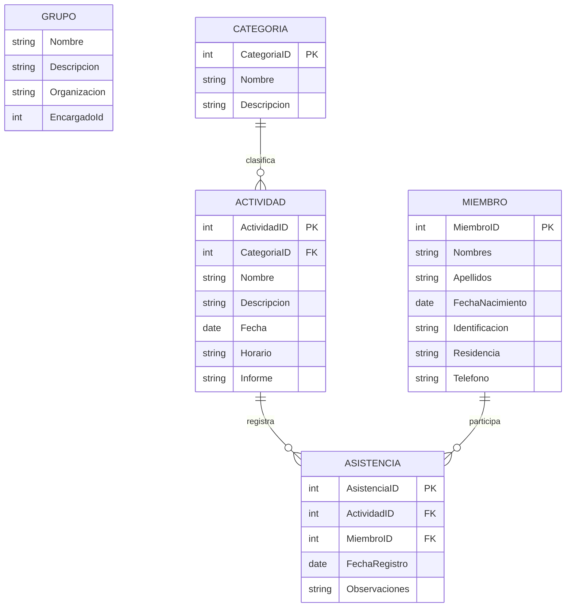

```mermaid
erDiagram

    GRUPO {
        string Nombre
        string Descripcion
        string Organizacion
        int EncargadoId
    }

    MIEMBRO {
        int MiembroID PK
        string Nombres
        string Apellidos
        date FechaNacimiento
        string Identificacion
        string Residencia
        string Telefono
    }

    CATEGORIA {
        int CategoriaID PK
        string Nombre
        string Descripcion
    }

    ACTIVIDAD {
        int ActividadID PK
        int CategoriaID FK
        string Nombre
        string Descripcion
        date Fecha
        string Horario
        string Informe
    }

    ASISTENCIA {
        int AsistenciaID PK
        int ActividadID FK
        int MiembroID FK
        date FechaRegistro
        string Observaciones
    }

    CATEGORIA ||--o{ ACTIVIDAD : "clasifica"
    ACTIVIDAD ||--o{ ASISTENCIA : "registra"
    MIEMBRO ||--o{ ASISTENCIA : "participa"
```
